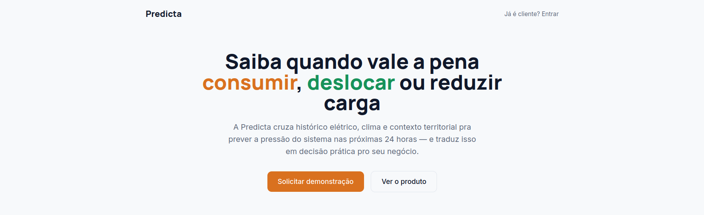
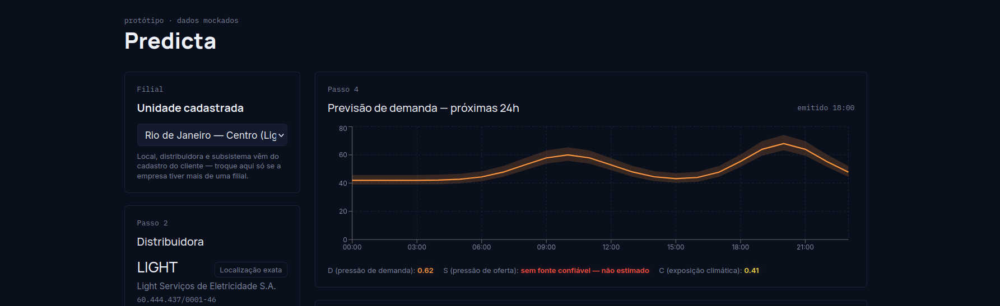

# frontend_web_hackathon-ia-2026
Repositório do serviço web do sistema Predicta de eficiência e economia energética para grandes empresas com cargas flexíveis a partir de análises climáticas e histórico da rede

## Como rodar

```bash
cd predicta-frontend
cp .env.local.example .env.local   # ajuste as variáveis abaixo
npm i        # instala as dependências
npm run dev  # inicia o servidor de desenvolvimento (http://localhost:3000)
```

Variáveis em `predicta-frontend/.env.local`:

- `NEXT_PUBLIC_API_BASE_URL` — URL da API Predicta (padrão `http://127.0.0.1:8000`). O backend precisa liberar CORS para a origem do frontend.
- `NEXT_PUBLIC_USE_MOCK` — `1` faz o dashboard usar dados sintéticos gerados no navegador, sem chamar a API (útil enquanto o backend não tem tarifas ANEEL e `system_signal_v1` carregados). A tela avisa que são dados de exemplo.

## Telas

A landing page apresenta a proposta da Predicta e direciona o visitante para o login:



O login é um protótipo de demonstração — qualquer e-mail e senha dão acesso ao dashboard:


Já autenticado, o cliente acompanha no dashboard a previsão de demanda das próximas 24h e os indicadores de pressão do sistema (demanda, oferta e exposição climática) para a filial selecionada:


