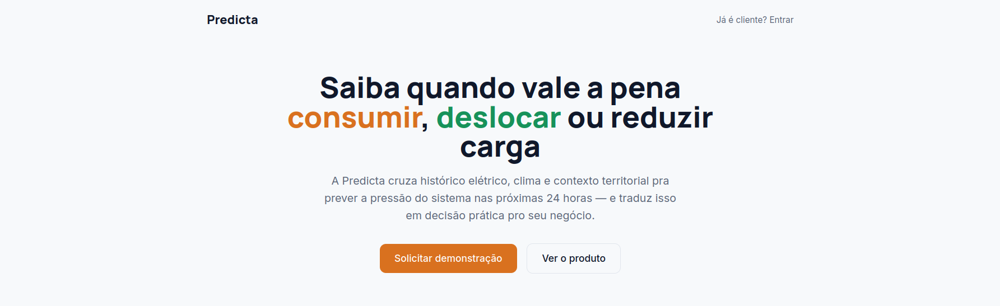
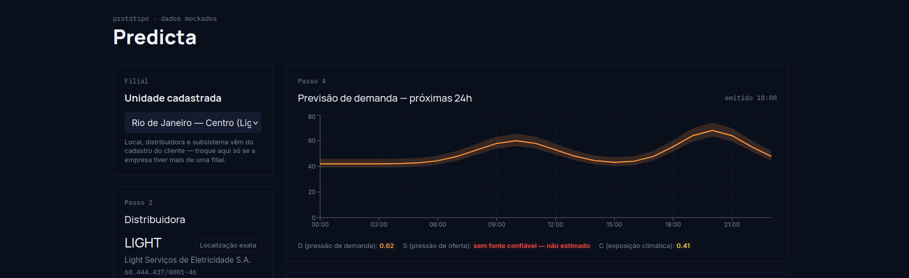

# frontend_web_hackathon-ia-2026
Repositório do serviço web do sistema Predicta de eficiência e economia energética para grandes empresas com cargas flexíveis a partir de análises climáticas e histórico da rede

## Como rodar

```bash
cd predicta-frontend
cp .env.local.example .env.local   # ajuste as variáveis abaixo
npm i        # instala as dependências
npm run dev  # inicia o servidor de desenvolvimento (http://localhost:3000)
```

Variáveis em `predicta-frontend/.env.local`:

- `NEXT_PUBLIC_API_BASE_URL` — URL da API Predicta (padrão `http://127.0.0.1:8000`). O backend precisa liberar CORS para a origem do frontend.

## Telas

A landing page apresenta a proposta da Predicta e direciona o visitante para o login:



O login é um protótipo de demonstração — qualquer e-mail e senha dão acesso ao dashboard:


Já autenticado, o cliente acompanha no dashboard os avisos do dia, a agenda dos equipamentos flexíveis e a comparação entre a tarifa-base e a tarifa dinâmica das 24h simuladas:



> A captura acima é anterior à reorganização do painel (ainda mostra o gráfico de demanda e o seletor de região) — precisa ser refeita.

## Estrutura

O painel do cliente fica sob `app/(painel)/`, com o `AppShell` (cabeçalho, abas e sino de avisos) e o `ClienteProvider`, que centraliza plano, contrato, carga flexível e a simulação vigente. As páginas são: **Painel**, **Carga flexível**, **Economia**, **Recomendações**, **Notificações**, **Perfil** e **Planos**.

Enquanto não existe cadastro nem login de verdade, os dados da empresa usuária ficam em `lib/usuario.ts` e aparecem em **/perfil** — é de lá que saem a distribuidora, o subsistema e o consumo contratado, então o painel não pede essas escolhas. Distribuidora e dia simulado podem ser trocados em /perfil, num bloco marcado como exclusivo da demonstração.

Há ainda `/verificacao`, uma tela técnica que mostra o request e a resposta crus da API lado a lado com os números recalculados no frontend. Ela fica **fora do menu de propósito** e é acessada só pela URL direta.
