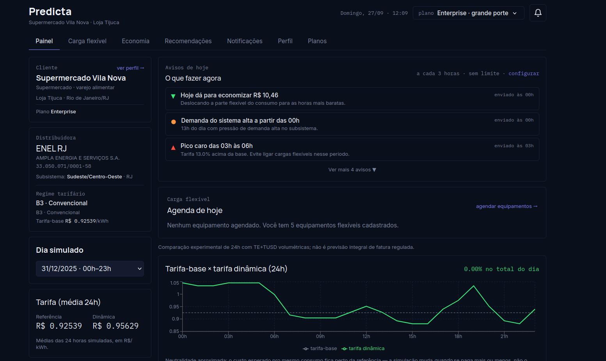
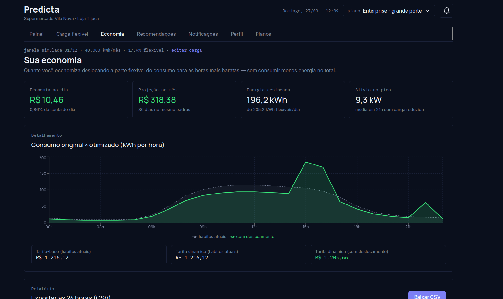
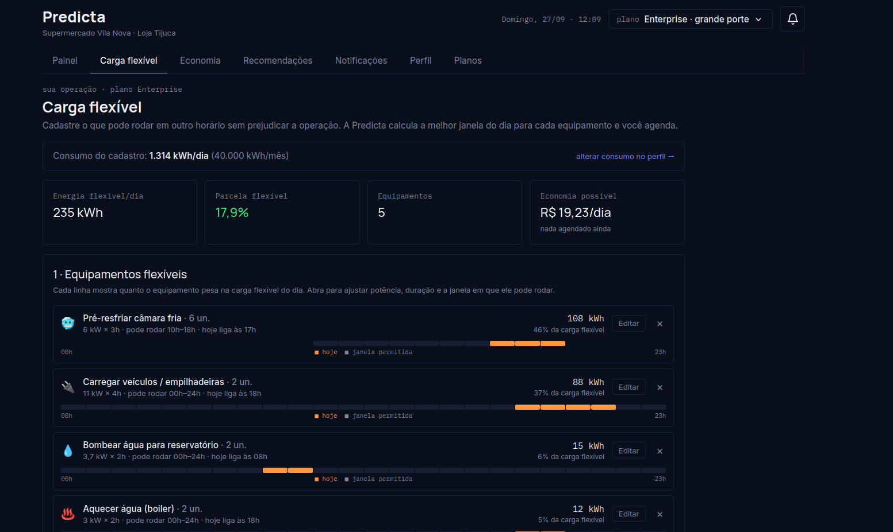
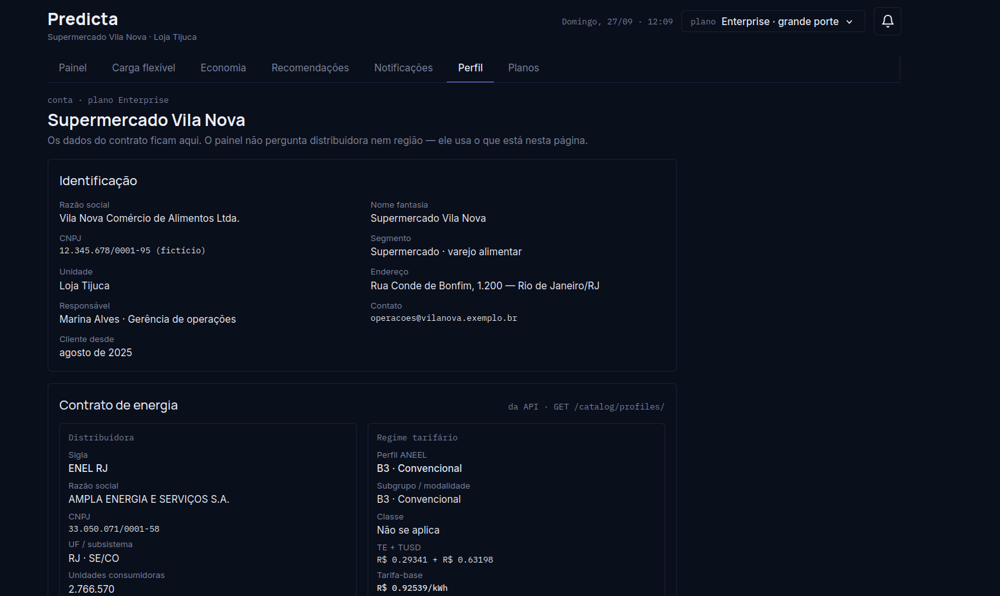
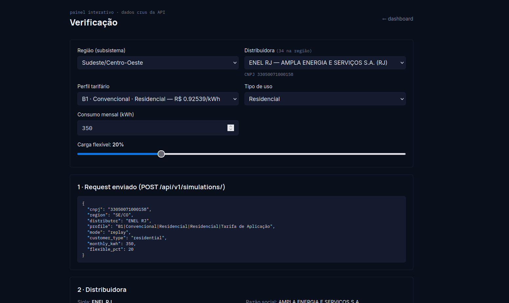
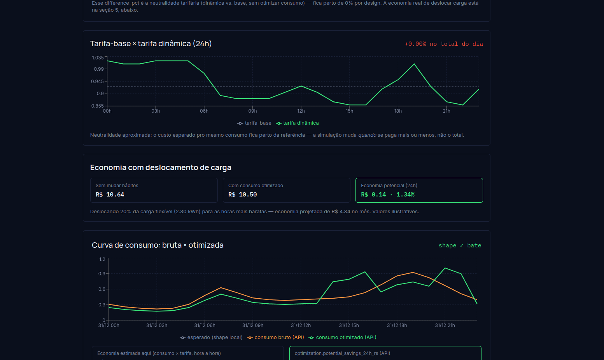

# Predicta — frontend web

Serviço web do sistema Predicta de eficiência e economia energética para empresas com cargas
flexíveis, a partir de análises climáticas e do histórico da rede.

A ideia central: a tarifa dinâmica simulada **não muda quanto você paga no total, muda _quando_
vale a pena consumir**. O cliente cadastra os equipamentos que consegue ligar em outro horário, e a
Predicta diz a melhor janela do dia para cada um e quanto isso economiza.

Hackathon COPPE/UFRJ IA 2026 · Grupo 20.

## Como rodar

```bash
cd predicta-frontend
cp .env.local.example .env.local   # ajuste a variável abaixo
npm i        # instala as dependências
npm run dev  # http://localhost:3000
```

Next.js 14 (App Router), TypeScript, Tailwind e Recharts.

| Variável | Para quê |
| --- | --- |
| `NEXT_PUBLIC_API_BASE_URL` | URL da API Predicta. Padrão `http://127.0.0.1:8000`. |

Como é uma variável `NEXT_PUBLIC_*`, ela é **embutida no build** — mudá-la em produção (Vercel)
exige um novo deploy, não basta salvar a variável.

### O backend precisa liberar CORS

O frontend é servido de uma origem diferente da API, então o navegador exige os cabeçalhos de CORS.
Sem eles, o `fetch` falha com `TypeError` e a interface mostra "Não foi possível conectar à API
(rede ou CORS)" — enquanto um `curl` do mesmo endereço funciona, porque `curl` não manda `Origin`.

Um detalhe que costuma passar batido: `lib/api.ts` envia `Content-Type: application/json` em
**todas** as chamadas, inclusive nos GET. Esse valor não está na lista segura do CORS, então o
navegador dispara um **preflight `OPTIONS` antes de cada GET**, não só antes do POST. Uma
configuração que só trate requisições simples não resolve.

No Django, com `django-cors-headers`:

```python
INSTALLED_APPS = [..., "corsheaders"]
MIDDLEWARE = ["corsheaders.middleware.CorsMiddleware", "django.middleware.common.CommonMiddleware", ...]
CORS_ALLOWED_ORIGINS = ["https://<app>.vercel.app"]
CORS_ALLOWED_ORIGIN_REGEXES = [r"^https://.*\.vercel\.app$"]  # previews
```

Para conferir de fora, mandando `Origin` como o navegador faz:

```bash
curl -si -H "Origin: https://<app>.vercel.app" \
  "$API/api/v1/simulations/options/?region=SE%2FCO&mode=replay" | grep -i access-control
```

## O que o frontend consome da API

Sem autenticação, tudo sob `/api/v1/`. As chamadas ficam centralizadas em
[`lib/api.ts`](predicta-frontend/lib/api.ts), com cache de TTL curto (20s) para absorver rajadas de
requisições idênticas — o backend pode estar acordando de um cold start.

| Endpoint | Uso |
| --- | --- |
| `GET /catalog/distribution-areas/` | catálogo das 103 áreas de concessão da ANEEL; é de onde sai o CNPJ de cada distribuidora |
| `GET /catalog/profiles/?cnpj=&region=` | distribuidora e perfis tarifários vigentes daquele CNPJ |
| `GET /simulations/options/?region=&mode=` | janelas de replay disponíveis e se a região tem dados |
| `POST /simulations/` | a simulação em si: 24h de tarifa, demanda, consumo e otimização |

O backend valida `distributor` e `profile` contra a tabela da ANEEL, então esses ids **não ficam
fixos no frontend**: são buscados em `catalog/profiles/` e escolhidos em
[`lib/simulation.ts`](predicta-frontend/lib/simulation.ts) (o convencional do subgrupo do cliente,
descartando variantes como pré-pagamento, tarifa social e SCEE).

## Estrutura

O painel do cliente fica sob `app/(painel)/`, com dois pilares:

- **`AppShell`** — cabeçalho, abas, seletor de plano (demonstração) e o sino de avisos.
- **`ClienteProvider`** — estado único do cliente: plano, contrato, carga flexível e a simulação
  vigente. Toda página lê daqui; nenhuma busca simulação por conta própria.

Enquanto não existe cadastro nem login de verdade, os dados da empresa usuária vivem em
[`lib/usuario.ts`](predicta-frontend/lib/usuario.ts) — é o único arquivo que inventa dado de
cliente. Quando houver backend de contas, ele é substituído pela resposta do login sem mexer no
resto, porque só a página de perfil o lê diretamente.

## Telas

A landing apresenta a proposta e leva ao login, que é um protótipo: qualquer e-mail e senha entram.


### Painel

Mostra o dia: os avisos priorizados, a agenda dos equipamentos flexíveis e a comparação entre
tarifa-base e tarifa dinâmica nas 24h simuladas. A barra lateral traz o contrato — cliente,
distribuidora, regime tarifário e o dia simulado — **sem nenhum seletor de região ou distribuidora**,
porque isso é cadastro, não escolha de operação.



### Economia

Quanto se economiza deslocando a parte flexível do consumo, com a curva de consumo original contra
a otimizada e os três custos lado a lado (tarifa-base, dinâmica sem mudar hábitos, e dinâmica com
deslocamento). Os números vêm do bloco `optimization` da API — o frontend não recalcula economia.



### Carga flexível

O cadastro do que pode rodar em outro horário. Cada equipamento mostra quanto pesa na carga
flexível do dia, e a fita de 24h deixa ver de relance a janela permitida pela operação, o horário em
que ele liga hoje e a janela recomendada. É a soma desses equipamentos que vira o `flexible_pct`
enviado na simulação — e, portanto, a economia.



### Perfil

O cadastro do cliente: identificação, contrato de energia (distribuidora e regime tarifário vindos
da API), consumo contratado e assinatura. É aqui, e só aqui, que a distribuidora e o dia simulado
podem ser trocados, num bloco marcado como exclusivo da demonstração.



### Verificação (`/verificacao`, fora do menu)

Tela técnica de conferência, **acessível apenas pela URL direta** — não aparece na navegação. Serve
para comparar o que foi pedido à API com o que ela respondeu, e conferir os números do painel contra
o backend. Diferente do painel, aqui tudo é livre: região, distribuidora (as 103 do catálogo), perfil
tarifário, tipo de uso, consumo e percentual flexível.



Abaixo do request vêm as respostas cruas e os gráficos, incluindo a comparação de tarifa e uma
checagem da curva de consumo recalculada no frontend contra a que a API devolveu.



## Duas coisas que confundem ao ler os números

**`difference_pct` não é a economia.** É a neutralidade tarifária: o custo do *mesmo* consumo na
tarifa dinâmica contra a tarifa-base, que fica perto de 0% por design. A economia real é o
`optimization.potential_savings_*`, que só aparece quando a carga é deslocada.

**`demand_pressure` não é o nível de demanda.** É o percentil daquela hora contra o histórico da
*mesma hora e mês* (`demand_context: "HOUR_MONTH"`). Por isso a hora de maior consumo do dia pode
não ser a de maior pressão: às 19h a demanda é a maior do dia, mas é também a esperada para o
horário; já uma madrugada acima do normal para madrugadas marca pressão alta. Consequência prática:
a curva de preço não acompanha a forma da curva de demanda, e isso é intencional.

## Estado e limitações

- **Modo replay.** As regiões ainda não têm 24h operacionais publicadas em `system_signal_v1`, então
  a simulação reexibe um dia histórico como se fosse a previsão do dia seguinte. O seletor de dia
  simulado existe por isso.
- **Dados dependem do backend.** Se `catalog/profiles/` devolver lista vazia para um CNPJ, é porque
  as tarifas processadas não foram carregadas — a interface diz isso explicitamente em vez de
  mostrar um erro genérico.
- **SE/CO (Enel RJ) é a única distribuidora validada ponta a ponta.** As demais estão no catálogo e
  podem ser escolhidas, mas dependem de o backend ter tarifa para elas.
- **Persistência é local.** Plano, contrato escolhido, carga flexível e preferências de notificação
  ficam no `localStorage` do navegador. Em produção, vão para a conta do cliente.
- **Tarifa dinâmica experimental**, com TE + TUSD volumétricas. Não inclui tributos, bandeiras nem
  demanda contratada, e não é fatura regulada.
